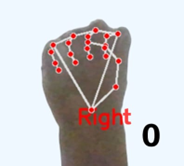
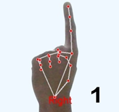
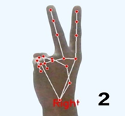
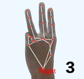
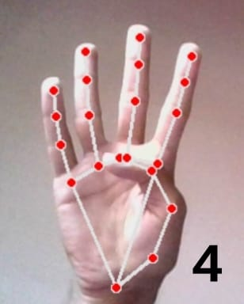
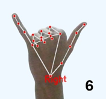
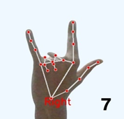
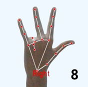
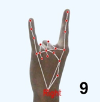

# HandyMath

HandyMath is a computer‐vision “gesture calculator” that lets you draw numbers and operators in the air and computes the result in real time. Everything runs on your webcam feed with an FPS counter and overlays for the current expression and result.

[Preview](https://drive.google.com/file/d/1aLH89HAaP0Nm-2BDtQwHrY3lzPPLD85L/view?usp=sharing)

## Requirements

[Install Python on Your Device](https://www.python.org/downloads/)

## How to run

```bash
# Clone the repository
git clone https://github.com/makmodol1173/HandyMath.git
cd HandyMath

# Install required module
pip install -r requirements.txt

# Run the app
python main.py
```

## Features

- **Arithmetic Equation Solver** (supports +, -, \*, /, ^, parentheses)
- **Matrix Solver** (Add, Subtract, Multiply, Transpose, Determinant, Inverse)
- **Hand Gesture Input** (dual-hand support)
- **Voice Feedback** for better accessibility

## Gesture Controls

### Hand Gesture Reference

<table>
  <tr>
    <td><br/>0</td>
    <td><br/>1</td>
    <td><br/>2</td>
    <td><br/>3</td>
    <td><br/>4</td>
  </tr>
  <tr>
    <td><br/>5</td>
    <td><br/>6</td>
    <td><br/>7</td>
    <td><br/>8</td>
    <td><br/>9</td>
  </tr>
</table>

### Right Hand — **Number Input**

| Index | Decription            | Symbol |
| ----- | --------------------- | ------ |
| `0`   | All fingers closed    | `0`    |
| `1`   | Index finger          | `1`    |
| `2`   | Index + Middle        | `2`    |
| `3`   | Index + Middle + Ring | `3`    |
| `4`   | Four fingers          | `4`    |
| `5`   | All fingers open      | `5`    |
| `6`   | Thumb + Pinky         | `6`    |
| `7`   | Thumb + Two fingers   | `7`    |
| `8`   | Three fingers + Thumb | `8`    |
| `9`   | Index + Pinky         | `9`    |

### Left Hand — **Operators**

| Index | Decription            | Symbol |
| ----- | --------------------- | ------ |
| `0`   | All fingers closed    | `=`    |
| `1`   | Index finger          | `+`    |
| `2`   | Index + Middle        | `-`    |
| `3`   | Index + Middle + Ring | `*`    |
| `4`   | Four fingers          | `/`    |
| `5`   | All fingers open      | `^`    |
| `6`   | Thumb + Pinky         | `(`    |
| `7`   | Thumb + Two fingers   | `)`    |
| `8`   | Three fingers + Thumb | `E`    |
| `9`   | Index + Pinky         | `X`    |
