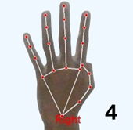
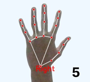

# Real-Time Hand Gesture Recognition System for Arithmetic Equation & Matrix Solver

This Python-based system enables users to solve both **arithmetic equations** and **matrix operations** using only **hand gestures**—no physical input needed! Built with **OpenCV**, **MediaPipe**, and **NumPy**, it’s designed for intuitive, hands-free control and is especially helpful for accessibility purposes.

---

## 🚀 Features

- 🧮 **Arithmetic Equation Solver** (supports +, -, *, /, ^, parentheses)
- 🟰 **Matrix Solver** (Add, Subtract, Multiply, Transpose, Determinant, Inverse)
- ✋ **Hand Gesture Input** (dual-hand support)
- 🧏 **Voice Feedback** for better accessibility (optional)
- 🔁 **Mode Switching** between Equation and Matrix Solver using gestures
- 🖐️ **Two-Hands Thumbs Up** to start interaction

---

## 🧠 Gesture Controls

### ✋ Hand Gesture Reference

<table>
  <tr>
    <td align="center"><br/>0</td>
    <td align="center"><br/>1</td>
    <td align="center"><br/>2</td>
    <td align="center"><br/>3</td>
    <td align="center"><br/>4</td>
  </tr>
  <tr>
    <td align="center"><br/>5</td>
    <td align="center"><br/>6</td>
    <td align="center"><br/>7</td>
    <td align="center"><br/>8</td>
    <td align="center"><br/>9</td>
  </tr>
</table>

### Start Input Mode

👍👍 **Show Two Hands Thumbs Up** to activate the system.

### ✋ Right Hand — **Number Input**

| Gesture Configuration    | Meaning |
|--------------------------|---------|
|  All fingers closed      | `0`     |
|  Index finger            | `1`     |
|  Index + Middle          | `2`     |
|  Index + Middle + Ring   | `3`     |
|  Four fingers            | `4`     |
|  All fingers open        | `5`     |
|  Thumb + Pinky           | `6`     |
|  Thumb + Two fingers     | `7`     |
|  Three fingers + Thumb   | `8`     |
|  Index + Pinky           | `9`     |

### 🖐️ Left Hand — **Operators & Control**

| Gesture Configuration    | Symbol | Function                            |
|--------------------------|--------|-------------------------------------|
|  Fist                    | `=`    | Evaluate Expression / Confirm Input |
|  Index finger            | `+`    | Addition                            |
|  Index + Middle          | `-`    | Subtraction                         |
|  Index + Middle + Ring   | `*`    | Multiplication                      |
|  Four fingers            | `/`    | Division                            |
|  All fingers             | `^`    | Power / Exponent                    |
|  Thumb + Pinky           | `(`    | Open Parenthesis                    |
|  Thumb + Two fingers     | `)`    | Close Parenthesis                   |
|  Three fingers + Thumb   | `E`    | Clear/Cancel                        |
|  Index + Pinky           | `X`    | Switch Calculator <-> Matrix Mode   |

---

## 🔁 Matrix Solver Gesture Flow

### Mode Switching

- ✌️ Show `X` gesture → Switch to Matrix Mode or back to Arithmetic Mode

### Matrix Creation (via `X` from OPERATION mode)

1. `X` → Start Matrix Creation Mode
2. `1–9` → Matrix ID (e.g., M1)
3. `1–9` → Rows
4. `1–9` → Columns
5. Input values using right-hand digit gestures
6. Use `E` anytime to cancel

### Matrix Operations (from OPERATION mode)

| Gesture | Operation     |
|---------|---------------|
| `1`     | Add           |
| `2`     | Subtract      |
| `3`     | Multiply      |
| `4`     | Transpose     |
| `5`     | Determinant   |
| `6`     | Inverse       |

- Input one or two matrix IDs (e.g., M1, M2)
- Results are stored in `R`

---

## ▶️ How to Run

### 1. Clone the Repository

```bash
git clone https://github.com/makmodol1173/HandyMath.git
cd HandyMath
```

### 2. Create and Activate Virtual Environment (Optional)

```bash
python -m venv venv
source venv/bin/activate  # On Windows: venv\Scripts\activate
```

### 3. Install Dependencies

```bash
pip install -r requirements.txt
```

### 4. Run the Application

```bash
python Main.py
```

### 5. Exit

Press `q` to quit the app.

---

## 📦 Requirements

- Python 3.8+
- OpenCV
- MediaPipe
- NumPy
- pyttsx3 (for optional voice feedback)

---

## 🔮 Future Enhancements

- Real-time gesture training Unity Hub
- Multi-language voice narration
- Export to CSV for matrix results